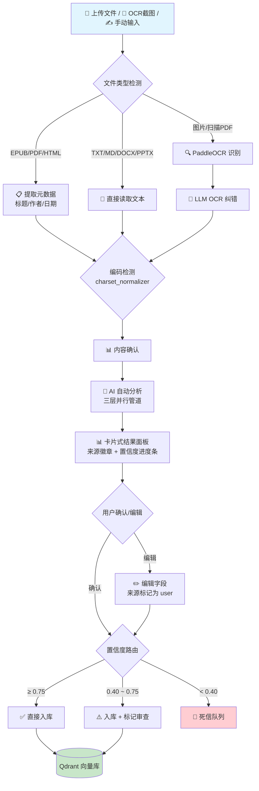
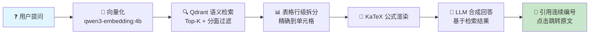
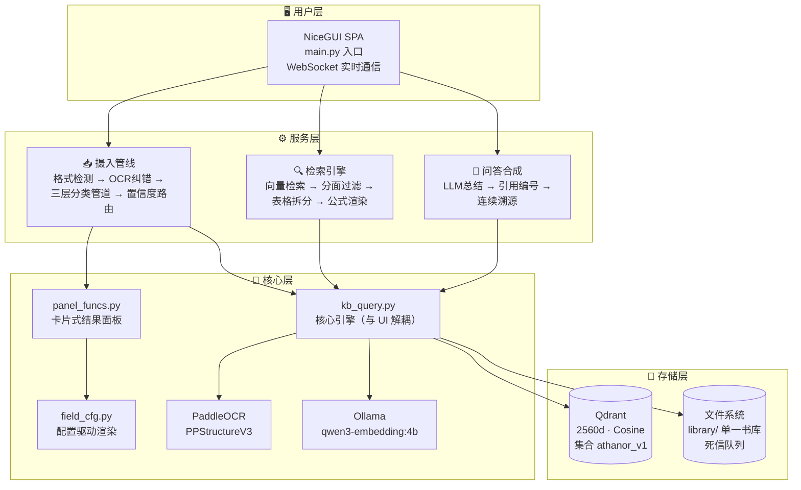

<p align="center">
  
</p>

<h1 align="center">Citrinitas · 熔知</h1>

<p align="center">
  <b>个人本地知识引擎</b><br>
  把截图、手册、笔记丢进去，问一个问题，直接得到<strong>带来源引用的答案</strong>。<br>
  数据全在本地，不联网也能用。
</p>

<p align="center">
  <a href="https://github.com/shiyao222333-afk/citrinitas"></a>
  <a href="https://github.com/shiyao222333-afk/citrinitas/blob/main/LICENSE"></a>
  
  <a href="https://github.com/shiyao222333-afk/citrinitas/stargazers"></a>
</p>

<p align="center">
  <a href="#-为什么需要-citrinitas"><b>🤔 为什么需要</b></a> ·
  <a href="#-项目亮点"><b>✨ 项目亮点</b></a> ·
  <a href="#-核心能力--竞品对比"><b>⚔️ 核心能力 & 竞品对比</b></a> ·
  <a href="#-操作流程"><b>🔄 操作流程</b></a> ·
  <a href="#-架构概览"><b>🏗️ 架构概览</b></a> ·
  <a href="#-目录结构"><b>📁 目录结构</b></a> ·
  <a href="#-技术栈"><b>🛠️ 技术栈</b></a> ·
  <a href="#-路线图"><b>🗺️ 路线图</b></a> ·
  <a href="#-快速开始"><b>⚡ 快速开始</b></a> ·
  <a href="https://github.com/shiyao222333-afk/citrinitas/issues"><b>🐛 提 Issue</b></a>
</p>

---

## 🤔 为什么需要 Citrinitas？

> **"有问题直接问 LLM（GPT/DeepSeek）不就行了，为什么要手动输入知识？"**

答案一句话：

> **LLM 是「聪明的外人」，Citrinitas 是「读过你所有资料的私人助理」。**

| 问题 | 直接问 LLM | 用 Citrinitas |
|------|-----------|-------------------|
| 没有你的私有知识 | ❌ 它没读过 | ✅ 直接搜你本地资料 |
| 没有记忆 | ❌ 每次对话都是新的 | ✅ 越用越强 |
| 无法溯源 | ❌ 答案不知道从哪来 | ✅ 每个答案带 `[引用N]` |
| 数据隐私 | ❌ 上传云端 | ✅ 全本地运行 |

---

## ✨ 项目亮点

- **📥 多格式摄入**：PDF / EPUB / Word / PPTX / 网页 / 图片 OCR / 纯文本，自动识别 8+ 种格式并提取元数据。
- **🧠 三层分类管道（含系统预填层）**：文件自带信息 + 关键词规则 + AI 兜底，三层自动标注分面字段，你只需确认。
- **🔬 认知验证层级（L0–L2）**：每条知识标「未验证 / 已证实 / 已 corroborated」，可信度一目了然。
- **🎯 精确溯源**：每个答案标注出处（第几章第几段、哪份文件），点击可回溯原文。
- **📚 单一书库存储层**：所有资料集中 `library/` 目录，图片统一存放，记住「第几章第几段」位置指针；重录同一份文件自动覆盖不复制。
- **📖 受控词表**：网页上直接维护标准词库（UDC 细分码 / 题材 / 关键词），自动纠正同义词，未受控词自动进待审核队列。
- **💡 闪念笔记**：灵感 / 突发奇想自动识别（💡 标记），搜索时相关灵感自动浮现。
- **🛡️ 自动化质检**：契约测试 + 存储医生 + 导入冒烟，防功能悄悄回退。

---

## ⚔️ 核心能力 & 竞品对比

> 下表把「功能对比」与「各有千秋」合成一张表，最后一行即各产品的核心定位差异。完整依据见 [docs/schema.md](docs/schema.md) · [PROJECT_PLAN.md](PROJECT_PLAN.md) · [CHANGELOG.md](CHANGELOG.md)。

| 对比维度 | 熔知 | RAGFlow | Dify | FastGPT | AnythingLLM |
|----------|:--:|:--:|:--:|:--:|:--:|
| 中文 OCR（手写/表格/公式） | ✅ | ✅ | ❌ | ❌ | ❌ |
| 分面分类（UDC 9 主类） | ✅ | ❌ | ❌ | ❌ | ❌ |
| LLM 自动分类（三层管道） | ✅ | ❌ | ❌ | ❌ | ❌ |
| 元数据自动提取 | ✅ | ❌ | ❌ | ❌ | ❌ |
| 认知验证层级（L0–L2） | ✅ | ❌ | ❌ | ❌ | ❌ |
| 精确溯源（章节 / 段落指针） | ✅ | ❌ | ❌ | ❌ | ❌ |
| 受控词表 / 同义词归一 | ✅ | ❌ | ❌ | ❌ | ❌ |
| 知识关系网（8 种关系） | 🔮 | ❌ | ❌ | ❌ | ❌ |
| 轻量一键部署（无 Docker） | ✅ | ❌ | ❌ | ❌ | ❌ |
| 企业多租户 | ❌ | ✅ | ✅ | 🟡 | ❌ |
| 可视化工作流编排 | ❌ | ❌ | ✅ | 🟡 | ❌ |
| Agent / 插件市场 | ❌ | ❌ | ✅ | ✅ | 🟡 |
| 多模型本地桌面部署 | ❌ | ❌ | ❌ | ❌ | ✅ |
| **核心定位 / 各有千秋** | 个人知识引擎：深度理解 + 结构化认知 + 精确溯源 | 企业级 RAG，强在多格式解析 + 多租户 | 可视化工作流编排，强在 Agent / 应用快速搭建 | 开箱即用客服 / 知识库 bot | 轻量桌面端，强在多模型本地部署 |

> 💡 要企业级 RAG 平台或多租户 → RAGFlow / Dify；要**个人知识深度理解**且愿意和项目一起成长 → 熔知更对路。

---

## 🔄 操作流程

### 摄入管线



### 搜索问答



---

## 🏗️ 架构概览



**分层职责：**

| 层 | 职责 |
|----|------|
| 用户层 | NiceGUI 单页应用，WebSocket 实时通信 |
| 服务层 | 摄入管线（检测/OCR/分类/路由）、检索引擎、问答合成 |
| 核心层 | `kb_query.py` 核心引擎与 UI 解耦；卡片式面板；配置驱动渲染；PaddleOCR；本地嵌入 |
| 存储层 | Qdrant 向量库（集合 `athanor_v1`，取自本项目英文功能名 **Athanor**）；`library/` 单一书库目录 + 死信队列 |

---

## 📁 目录结构

```text
citrinitas/
├── library/                 # 单一知识库根目录（资料真正保存处）
│   ├── books/               #   书籍源文件长期保留（.epub/.pdf/.docx/.txt/.md）
│   ├── images/              #   所有图片统一一处（书本插图 + OCR 抽取图）
│   ├── inbox/               #   待摄入文件（知识库前厅）
│   └── file_state.jsonl     #   已保存内容的状态索引
├── local_data/              # 程序运维杂物（不进 library/）
│   ├── logs/                #   运行日志
│   ├── reports/             #   质检报告
│   ├── dead_letter/         #   失败文件死信队列
│   └── activity_log.jsonl   #   活动日志
├── pages/                   # NiceGUI 界面（hub/ 子页、vocab、config、manage）
├── services/                # 摄入服务（ingest_service 等）
├── utils/                   # 工具层（file_handler 格式解析 / classification 分类）
├── scripts/                 # 运维脚本（storage_doctor / vocab_doctor）
├── tests/                   # 契约测试 + 导入冒烟
├── docs/                    # 设计文档（schema / 竞品研究）
├── main.py                  # 应用入口
└── run.bat / install.ps1    # 一键启动 / 安装
```

---

## 🛠️ 技术栈

| 层 | 技术 | 说明 |
|----|------|------|
| 向量数据库 | [Qdrant](https://github.com/qdrant/qdrant) | 2560d, Cosine, 单集合 `athanor_v1` |
| 嵌入模型 | [Ollama](https://github.com/ollama/ollama) + `qwen3-embedding:4b` | 本地推理，中英文兼顾 |
| OCR 引擎 | [PaddleOCR](https://github.com/PaddlePaddle/PaddleOCR) / PPStructureV3 | 中文优化，表格 + 公式识别 |
| LLM 合成 | OpenAI 兼容 API（默认 DeepSeek） | 可切换通义千问 / 本地模型 |
| 公式渲染 | [KaTeX](https://github.com/KaTeX/KaTeX) | 服务端渲染，矢量输出 |
| Web UI | [NiceGUI](https://nicegui.io) 3.13 | SPA, FastAPI + Vue + Quasar + WebSocket |
| 编码检测 | [charset_normalizer](https://github.com/jawah/charset_normalizer)（MIT） | UTF-8 → GBK → latin-1 兜底链 |
| 电子书解析 | 自研 `epub_reader`（纯标准库） | 零第三方授权依赖，替代 AGPL 的 ebooklib |

---

## 🗺️ 路线图

| 版本 | 状态 | 核心交付 |
|------|:----:|---------|
| v0.1.0 ~ v0.9.0 | ✅ | 地基→装修：CLI 搜索 / Web UI / 分面分类 v5.0 / 智能摄入 / 卡片面板 / 混合检索 / 知识库综合管理 |
| v1.0.0 | ✅ | 生产就绪：install.ps1 + run.bat 完整 + 守望夹 v2 + 100+ Bug 修复 |
| v1.0.1 | ✅ | 代码质量重构 II：死代码清理 + 大文件拆分 |
| v1.1.0 | ✅ | 架构重构 + 错误日志规范（含 v1.1.x 搜索加固系列 PATCH） |
| **v1.2.0** | ✅ | 闪念笔记：idea 自动识别 + 💡 标记 + 相关灵感自动浮现 |
| **v1.2.1** | ✅ | 书库存储层 + 受控词表 + 自动化质检（单一 `library/` 目录 / 确定性 doc_id / 存储原子性加固 / 契约测试 + 存储医生） |
| v1.3.0 | 🔮 | 对外接口：MCP（AI 专用工具接口）+ REST API（与其他软件 / 手机 App 对接），与 OpusMagnum 对接 |
| v1.4.0 | 🔮 | 知识关系网：NetworkX 图谱可视化 + 8 种关系类型 + QA 自动生成 |
| v1.5.0 | 🔮 | 录入预处理：网页 URL 直接摄入 + 多语言文档翻译入库 |
| v1.6.0 | 🔮 | LLM 智能选择：按任务复杂度自动选模型 |
| v1.7.0 | 🔮 | 性能优化：后台运行 + 内存优化 + 搜索缓存 |
| v1.8.0 | 🔮 | 知识保鲜：过期检测 + 更新提醒 + 自动归档 |
| v1.9.0 | 🔮 | UI 美化：自定义主题 + 深色模式 |
| v1.10.0 | 🔮 | 说明页面：完整文档体系 + 贡献指南 + API 文档 |

> 完整规划见 [PROJECT_PLAN.md](PROJECT_PLAN.md)。

---

## ⚡ 快速开始

```bash
# 前置条件
# Python >= 3.13, Ollama https://ollama.com
ollama pull qwen3-embedding:4b

# 一键部署
powershell -File install.ps1

# 启动
run.bat
# → 浏览器访问 http://127.0.0.1:8080
```

不需要 Docker，不需要手动配置环境变量。`run.bat` 启动后 Web UI 自动在浏览器打开，含启动成功横幅。

### 使用流程

1. **首次使用** → 自动弹出建库向导 → 选择嵌入模型 → 创建集合
2. **摄入资料** →「文档注入」页面上传文件或 OCR 截图
3. **维护受控词表** →「📖 受控词表」页面查看 / 增删标准词（UDC 细分码 / 题材 / 关键词），保存即时生效，下次摄入自动归一
4. **搜索问答** →「智能检索」页面输入问题，勾选是否启用 AI 问答
5. **管理知识** →「知识中枢」页面查看统计、审核队列、导出数据；配置页可一键强制全部摄入进待审核（便于验收新格式）

> 📘 详细指南：[START.md](START.md)

---

## 👤 适合谁用？

| ✅ 非常适合 | ❌ 不太适合 |
|------------|------------|
| 有中文技术文档 / 手册积累的人 | 数据量极小（<10 个文件）且不需要搜索 |
| 截图 / 照片里有大量文字需要检索 | 想要商业化完整 Web UI（我们还在迭代） |
| 关心数据隐私，不想上传云端 | 不想碰任何配置（首次需 2 分钟） |
| 需要精确溯源：答案从哪张图 / 哪份文档来 | |
| 公式 / 表格很多的技术文档 | |
| 小说作者（世界观设定管理） | |
| 学术研究者（论文 / 标准文档管理） | |

---

## ❓ FAQ

**Q：支持英文文档吗？**
A：支持。`qwen3-embedding:4b` 对中英文都有效果。英文场景可换 `nomic-embed-text`。

**Q：能处理多少数据？**
A：理论上无上限，受限于硬件。Qdrant 支持磁盘存储。建议先从小批量（几十个文件）开始。

**Q：和 Obsidian / Notion 有什么区别？**
A：Obsidian 是笔记管理，Notion 是在线协作。Citrinitas 专注**非结构化资料**（截图、扫描件、PDF）的**语义搜索和问答**。

**Q：需要联网吗？**
A：摄入和向量检索不需要联网。仅 LLM 合成回答时需联网（可切换本地 LLM 完全离线）。

**Q：向量集合为什么叫 `athanor_v1`？**
A：本项目采用两段式命名——**炼金阶段（Citrinitas）+ 功能名**，功能名中文为「熔知」、英文为「Athanor」。向量集合沿用英文功能名 Athanor，属正常命名，非历史遗留。

**Q：三层分类管道是什么？**
A：第 0 层系统直接读取文件自带信息（语言 / 来源 / 项目）；第 1 层关键词规则匹配；第 2 层 AI 兜底填补缺口；第 3 层程序算出分类可信度分数。前两层是「要动脑猜的」，所以对外统称「三层管道」。

**Q：能商用吗？**
A：核心以 MIT 协议开源，可自由使用、修改、分发。部分闭源增值能力（如未来高级信任聚合）将按「个人免费 / 专业版激活码 / 团队版」分层提供，详见 OpusMagnum 项目规划。

---

## 🤝 贡献

欢迎参与！项目处于活跃开发阶段，每一份贡献都能显著影响方向。

- 🐛 **报告 Bug**：[提交 Issue](https://github.com/shiyao222333-afk/citrinitas/issues/new)
- 💡 **功能请求**：[功能请求](https://github.com/shiyao222333-afk/citrinitas/issues/new?template=feature)
- 💻 **代码贡献**：Fork → 分支 → PR

---

## 📄 许可证

[MIT License](LICENSE) — 自由使用、修改和分发。

---

## 🙏 致谢

- [Qdrant](https://github.com/qdrant/qdrant) — 高性能向量数据库
- [Ollama](https://github.com/ollama/ollama) — 本地 LLM 运行环境
- [NiceGUI](https://nicegui.io) — Python SPA 框架
- [PaddleOCR](https://github.com/PaddlePaddle/PaddleOCR) — 中文 OCR 引擎
- [KaTeX](https://github.com/KaTeX/KaTeX) — 公式渲染引擎
- [UDC](https://www.udcsummary.info/) — 国际十进分类法

---

<p align="center">
  ⭐ 如果这个方向对你有用，欢迎点个 Star！<br>
  🗂️ 把你积累的知识，变成真正能用的资产。
</p>

<p align="center">
  
</p>
